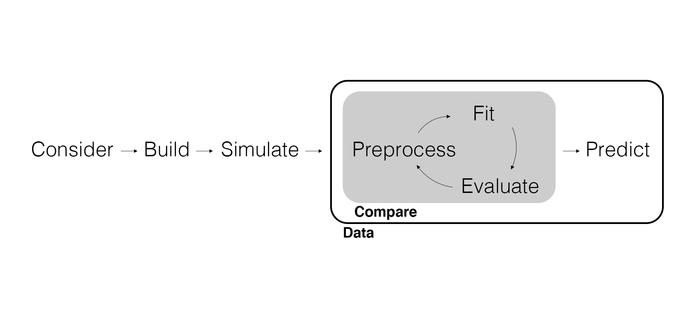

## Marketing Analytics Process

<center>
{width="900px"}
</center>

## Inferential Modeling Workflow

<center>
{width=900px}
</center>

---

{width=850px}

## Review the Workflow

<center>
{width=900px}
</center>

## Statistical and Causal Inference

Regression and how we interpret the parameter estimates *sounds* like causality, but regression doesn't *necessarily* describe causal relationships. There are two types of inference that are interconnected.

- **Statistical inference** is inferring associations (e.g., correlations) between variables.
- **Causal inference** is inferring *causal* associations between variables.

Discovering associations between variables is *common*. Uncovering causality is *uncommon*. We don't get causality by fitting and evaluating a statistical model. Causality comes from carefully considering the data generating process.

## Statistical and Causal Inference

<center>

{width=700px}

<center>

## DAG Redux

DAGs are used to detail the possible data generating process. The *paths* describe statistical associations. The *arrows* indicate causal associations.

<center>

{width=600px}

<center>

## What if we have multiple explanatory variables?

Including more than one explanatory variable is almost always a better approximation of the *data generating process*.

$$y = \beta_0 + \beta_1 x_1 + \beta_2 x_2 + ... + \beta_p x_p + \epsilon, \text{ where } \epsilon \sim Normal(0, 1)$$

- $y$ is the *outcome* variable.
- $x_1$ is the 1st *explanatory* variable.
- $x_p$ is the $p$th *explanatory* variable.
- $\beta_0$ is the *intercept* parameter.
- $\beta_1$ is the 1st *slope* parameter.
- $\beta_p$ is the $p$th *slope* parameter.
- $\epsilon$ is the *error* term.

## Simulating Data with Multiple Regression

Remember we can pretend that our model *is* the data generating process and simulate data.

```{r message=FALSE}
# Load packages.
library(tidyverse)
library(tidymodels)

# Set the randomization seed.
set.seed(123)

# Set variable and parameter values.
nobs <- 500
intercept <- 25
beta_discount <- 2
beta_endcaps <- 7
beta_temp <- 15
beta_coupon <- 5
beta_ad <- 10
```

## Review: Why do we simulate data?

- Set up a Framework (Model Validation and Debugging)
  - test whether your model behaves as expected
  - catch errors and implementation mistakes
  - set up a pipeline for your actual data
- Using the Model as a sanity check
  - you likely have some idea about what your data looks like - if you plug similar values into the model, do you get realistic outputs?
- Stress Test (Understand Impacts of Model Assumptions)
  - test how your model performs when assumptions are violated

---

We're going to `stress test' our model by **investigating potential problems** with the data. (Really, we're investigating issues with including/excluding variables that we shouldn't).

```{r}
sim_data <- tibble(
  # Simulate money spent on discounts.
  discount = runif(nobs, min = 0, max = 75),
  # Simulate money spent on endcap displays conditioned on cold temp.
  temp = rbinom(nobs, size = 1, prob = 0.3),
  endcaps = temp * 75 + runif(nobs, min = 0, max = 50),
  # Simulate three levels of features: none, coupon, and ads.
  feature = rbinom(nobs, size = 2, prob = 0.5),
  feature_coupon = if_else(feature == 1, 1, 0),
  feature_ad = if_else(feature == 2, 1, 0),
  # Simulate category promotion as a function of discounts and features.
  category = 70 * discount + 30 * feature + rnorm(nobs, mean = 50, sd = 5),
  # Simulate sales as a function of all four variables.
  sales = intercept + beta_discount * discount + beta_endcaps * endcaps + 
    beta_temp * temp + beta_coupon * feature_coupon + beta_ad * feature_ad + 
    rnorm(nobs, mean = 0, sd = 5)
)
```

## DAG for the Simulated Data

```{r echo=FALSE, message=FALSE, warning=FALSE}
# Create a DAG.
library(dagitty)
library(ggdag)

dag <- dagitty("dag {
  Temp -> End
  Temp -> Sales
  End -> Sales
  
  Disc -> Cat
  Feat -> Cat
  Cat -> Sales
  Feat -> Sales
}")

ggdag(dag, layout = "circle") +
  theme_dag()
```

---

```{r}
sim_data
```

## Finding the Best *Hyperplane*

We still estimate $\beta_0$ , $\beta_1$ , ..., $\beta_p$ by minimizing the sum of the squared residuals.

However, as we move from one explanatory variable (a line) to two (a plane) to three or more (a hyperplane), it becomes increasingly difficult to visualize the process of fitting the model to the data.

Fortunately, this doesn't hinder the intuition or our ability to fit multiple regression.

```{r}
# Fit the complete model.
fit_01 <- linear_reg() |> 
  set_engine("lm") |> 
  fit(sales ~ discount + endcaps + temp + feature_coupon + feature_ad, data = sim_data)
```

---

<center>

{width=800px}

<center>

## Recover Parameters

Remember that `intercept = 25`, `discount = 2`, `endcaps = 7`, `temp = 15`, `feature_coupon = 5`, and `feature_ad = 10`.

```{r}
tidy(fit_01, conf.int = TRUE)
```

## Parameter Estimates

$$sales = 24.85 + 2.02 \times discount + 6.99 \times endcaps + \\ 15.88 \times temp + 4.65 \times feature_{coupon} + 10.01 \times feature_{ad}$$

How does this change parameter interpretations?

- The intercept parameter $\beta_0$ represents the expected value of $y$ when all explanatory variables ($x_1$, ..., $x_p$) are equal to zero.
- If $x_1$ is continuous, the associated slope parameter $\beta_1$ represents the expected amount by which $y$ will change given a one unit increase in $x_1$, **holding all other variables ($x_2$, ..., $x_p$) fixed**.
- If $x_1$ is discrete, the associated slope parameter $\beta_1$ represents the expected amount by which $y$ will change **relative** to the *baseline level* of $x_1$, **holding all other variables ($x_2$, ..., $x_p$) fixed**.

---

```{r}
tidy(fit_01, conf.int = TRUE) |> 
  ggplot(aes(x = term)) + 
  geom_point(aes(y = estimate)) + 
  geom_errorbar(aes(ymin = conf.low, ymax = conf.high), width = .1) +
  geom_hline(yintercept = 0, color = "red")
```

## Omitted Variable Bias

When adding explanatory variables, we need to do everything we can to include variables that explain the outcome so we don't create **omitted variable bias**.

Why would omitting an explanatory variable create bias?

```{r}
# Fit a model with an omitted variable.
fit_02 <- linear_reg() |> 
  set_engine("lm") |> 
  fit(sales ~ discount + endcaps + feature_coupon + feature_ad, data = sim_data)
```

---

Remember that `intercept = 25`, `discount = 2`, `endcaps = 7`, `temp = 15`, `feature_coupon = 5`, and `feature_ad = 10`.

```{r}
tidy(fit_02, conf.int = TRUE)
```

---

```{r}
tidy(fit_02, conf.int = TRUE) |> 
  ggplot(aes(x = term)) + 
  geom_point(aes(y = estimate)) + 
  geom_errorbar(aes(ymin = conf.low, ymax = conf.high), width = .1) +
  geom_hline(yintercept = 0, color = "red")
```

---

The association between `temp`, `endcaps`, and `sales` is a **fork**. If we want to estimate the causal effect of `endcaps` on `sales`, we need to control for the effect of `temp`.

```{r echo=FALSE, message=FALSE, warning=FALSE}
# Create a DAG.
library(dagitty)
library(ggdag)

dag <- dagitty("dag {
  Temp -> End
  Temp -> Sales
  End -> Sales
  
  Disc -> Cat
  Feat -> Cat
  Cat -> Sales
  Feat -> Sales
}")

ggdag(dag, layout = "circle") +
  theme_dag()
```

## Included Variable Bias

This might suggest we should throw everything we can in the model. However, when adding explanatory variables, we need to be careful not to include explanatory variables that create **included variable bias**.

Why would including an explanatory variable create bias?

```{r}
# Fit a model with included variable bias.
fit_03 <- linear_reg() |> 
  set_engine("lm") |> 
  fit(
    sales ~ discount + endcaps + temp + feature_coupon + feature_ad + category, 
    data = sim_data
  )
```

---

Remember that `intercept = 25`, `discount = 2`, `endcaps = 7`, `temp = 15`, `feature_coupon = 5`, and `feature_ad = 10`.

```{r}
tidy(fit_03, conf.int = TRUE)
```

---

```{r}
tidy(fit_03, conf.int = TRUE) |> 
  ggplot(aes(x = term)) + 
  geom_point(aes(y = estimate)) + 
  geom_errorbar(aes(ymin = conf.low, ymax = conf.high), width = .1) +
  geom_hline(yintercept = 0, color = "red")
```

---

There is no association between `discount` and `features`, but they meet at `category` in a **collider**. Including `category` *creates* an association between `discount` and `features`. Additionally, the association between `discount` and `sales` goes through `category` in a **pipe**. If we include `category`, the effect of `discount` is accounted for entirely by `category`.

```{r echo=FALSE, message=FALSE, warning=FALSE}
# Create a DAG.
library(dagitty)
library(ggdag)

dag <- dagitty("dag {
  Temp -> End
  Temp -> Sales
  End -> Sales
  
  Disc -> Cat
  Feat -> Cat
  Cat -> Sales
  Feat -> Sales
}")

ggdag(dag, layout = "circle") +
  theme_dag()
```

## Multicollinearity

More formally, when adding explanatory variables, we need to avoid including variables that are highly correlated, something called **multicollinearity**.

## Considerations

Be thoughtful when adding explanatory variables. Once again, consider the data generating process and use a DAG.

- Think carefully about the variables in your data! People often encounter problems when one variable is a *function* of another.
- Use `cor()` on continuous explanatory variables to check for multicollinearity.
- Statistical significance and model comparisons can be informative, but they don't guarantee correct modeling decisions.

Be transparent about the decisions you make about adding and excluding explanatory variables.

---

```{r eval=FALSE}
bind_rows(
  glance(fit_01), # The complete model.
  glance(fit_02), # Model with omitted variable bias.
  glance(fit_03)  # Model with included variable bias.
)
```

```{r echo=FALSE}
bind_rows(
  glance(fit_01), # The complete model.
  glance(fit_02), # Model with omitted variable bias.
  glance(fit_03)  # Model with included variable bias.
) |> 
  select(r.squared:logLik) |> 
  as.data.frame()
```

## Wrapping Up

*Summary*

- Extended regression to include multiple explanatory variables.
- Introduce plotting for parameter estimates.
- Used simulated data to demonstrate challenges with adding explanatory variables.

*Next Time*

- Overfitting and prediction.

## Exercise 11

Multiple regression is often referred to as "key drivers analysis" in business applications. In the Nielsen `soup_data`, now available on the AWS database, the outcome of interest is `Sales`.

1. Using `soup_data`, build and compare four *multiple* regressions for `CAMPBELL’S Sales` for the `WEST CENSUS TA` using different combinations (your choice) of the following promotional explanatory variables: `Any_Disp_Spend` (spend on in-store displays), `Any_Feat_Spend` (spend on coupons and other printed promotions, collectively called "features"), and `Any_Price_Decr_Spend` (spend on price decreases).
2. Use the best-fitting model to predict counterfactual `Sales` for Campbell’s. Assume that Campbell's can spend up to $10,000 for this trading area. Produce predictions for four counterfactual scenarios and use them to detail a proposal for Campbell's for the `WEST CENSUS TA`.
3. Render the Quarto document into Word and upload to Canvas.

